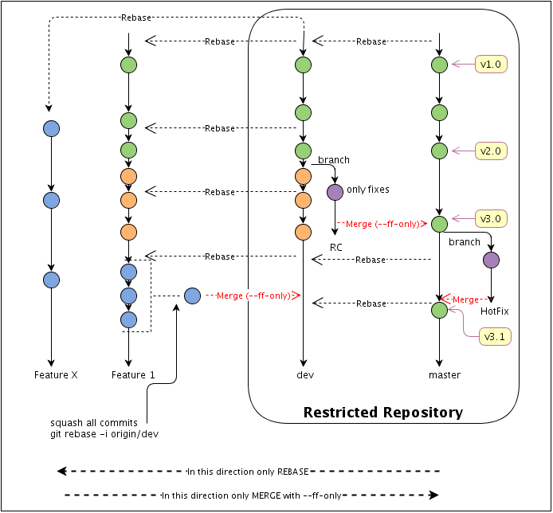

**Author: Anar Manafov (<Anar.Manafov@gmail.com>)**

---

**Table of Contents**

- [Introduction](#introduction)
- [Requirements and Tips](#requirements-and-tips)
- [The workflow](#the-workflow)
  - [Important](#important)
  - [Branches](#branches)
    - [master branch](#master-branch)
    - [dev branch](#dev-branch)
    - [RC branch](#rc-branch)
    - [HotFix branch](#hotfix-branch)
    - [FEATURE/TICKET branches](#featureticket-branches)
  - [Roles](#roles)
- [User stories](#user-stories)
  - [Developers](#developers)
    - [Prepare the environment](#prepare-the-environment)
    - [Create a feature branch](#create-a-feature-branch)
    - [Sync your feature branch](#sync-your-feature-branch)
    - [Request to pull](#request-to-pull)
    - [Create patches](#create-patches)
    - [Apply a patch](#apply-a-patch)
  - [Release manager](#release-manager)
    - [Prepare the environment](#prepare-the-environment-1)
    - [Process pull requests](#process-pull-requests)
    - [Prepare a Release Candidate](#prepare-a-release-candidate)
    - [Hot Fixes](#hot-fixes)
- [Tips and HOWTOs](#tips-and-howtos)
  - [How to recover after upstream branch was rebased](#how-to-recover-after-upstream-branch-was-rebased)

# Introduction

This document describes a git workflow for development teams. The workflow aims to provide:

- uninterruptible development,
- a stable and releasable at any time master,
- a multilevel protection against conflicts,
- a multilevel possibility to recover from errors/mistakes before changes come into the master,
- a clean, leaner history of the master branch without merge commits and other unwanted garbage.

> [!IMPORTANT]
> Treat public history as immutable, atomic, and easy to follow.  
> Treat private history as disposable and malleable.

---

# Requirements and Tips

- Use one branch per feature/bug (contained development).
  Every tick/task/feature MUST be implemented on a separate branch. Basically each JIRA ticket should be represented by at least one branch.
- Only release managers are allowed to work on the central master branch.
- Cherry picking MUST not be used by any means.
- A good use of branches should prevent the need of `git cherry-pick`.
- DO NOT create very large repositories.
- DO NOT commit large binary files or make sure you git repo supports [git LFS](https://git-lfs.com).
- DO NOT commit any file, which can be regenerated or which is generated automatically by your development environment.
- Remember to rebase your feature branch before merging it to the Development branch.
- Specify the origin and branch when pushing (might avoid mistakes).
- Use `git pull --rebase` in order to avoid merges from upstream commits.

# The workflow



## Important

In your development process, you must strictly distinguish between Features, Fixes and Hot Fixes.

- **Features**, **Fixes** - are patches, which can wait until the next release of the product. This is why they travail starting from private feature branches ---> the central dev branch ---> the central release branch ---> the central master
- **Hot Fixes** - are the patches, which can't wait and must be applied directly on a release version of the product. This is why they have completely different path: a new private branch from the given tag on the central master  ---> central master.

## Branches

There are only a few long term branches - **master** and **dev**.  
All other branches should be deleted as soon as their commits are merged into the master or you don't need them.

Use the following command to find out branches, which a merged into the mainrepo/master:

```shell
git branch --merged mainrepo/master 
```

or not merged:

```shell
git branch --no-merged mainrepo/master 
```

### master branch

Contains all the stable, released code.

- All released versions of all modules should be tagged in the master.
- No separate branches for the released versions.
- The master branch is ready to build at any moment.
- No development should be performed on the master branch directly.
- Only release managers have write permissions on it.
- The master branch rolls only forward, no history changes are allowed on the master branch.
- All new patches are introduced in the master branch only via `git merge --ff-only`.

### dev branch

- The branch is inherited from the latest master.

- The dev branch is a development mainstream.
- A release manager defines a list of tasks for a development sprint. For each task, developers MUST create a separate branch inherited from the **dev** branch.
- Should be rebased from the **master** each time **master** is changed.

### RC branch

RC or ReleaseCandidate branch is a temporary branch. This branch intends to provide uninterruptible development - to avoid such mails like "Please do not commit..., we freeze a branch" :).

At the moment of a release, a release manager will branch from **dev** to create an **RC** branch to start a release procedure. It also means feature freeze on the **RC** branch and only bug fixes can be introduced on it - no commits with new features.

While a release manager works on the **RC** branch, all developers continue developing in **dev** and in their feature branches - uninterruptible development.

The branch should be deleted as soon as it has been merged with the **master**. Once the **RC** branch is merged into the **master**, the **dev** branch should be rebased from the **master**. The rebases might require [a parent commit change](#how-to-recover-after-upstream-branch-was-rebased), if git is not able to rebase automatically.

### HotFix branch

It is a branch for hot fixes. It should contain only urgent hot fixes for the released versions, which can't wait until the next scheduled release of the product.

Once a hot fix is merged back in to the **master**, the **dev** branch should be rebased from the master to get new changes.

The branch should be deleted as soon as merged with the master.

### FEATURE/TICKET branches

Each business or development task/ticket/feature should have at least one feature branch. Such branches must be rebased to **dev** as often as possible to simplify future merging.

Rebasing is important to keep new commits together for possible tuning or squashing in the feature.

Whenever a feature is ready (or a stable part of the feature) it can be merged with the **dev** branch.

It is recommended to keep feature branches even after their merge with **dev**. It will simplify fine tuning in case if the feature represented by the branch will be reverted from the **dev** for additional development or fixes/corrections.

Feature branches should be deleted as soon as their commits are merged into the **master** via the **dev** branch.

## Roles

Release manager (r/w: MASTER, DEV, RC)
Developer (r/w: FEATURE(s), HOT FIX; read only: MASTER, DEV)

# User stories

In the following documentation we use:

- **mainrepo_url** - the url of the main repo, which is restricted and managed by release managers only. Developers must not have write permissions on it.
- **mainrepo** - the name of the main repo.
- **url_of_the_fork** - the url of your fork repo of the main repo.
- **developerrepo_url** - the url of a developer's repo.

## Developers

### Prepare the environment

1. setup git configuration. The following you have yo execute on all of your machines, or copy the git config to all of your machines.

    ```shell
    git config --global branch.autosetuprebase always
    git config --global user.name "FirsName LastName"
    git config --global user.email johndoe@example.com
    git config --global core.ignorecase false
    ```

1. Using github fork the main repo.

1. Create a local copy of the forked repo:

    ```shell
    git clone url_of_the_fork
    ```

1. Now when your **origin** points to your fork. You need to add the main repo to your remotes as well.
    You should have "origin --> you fork" and "mainrepo --> the main repo".

    ```shell
    git remote add mainrepo mainrepo_url
    git fetch mainrepo
    ```

1. Create a local dev branch

    ```shell
    git checkout -b dev mainrepo/dev
    ```

1. Push the local dev to your remote (forked repo):

    ```shell
    git push -u origin dev
    ```

### Create a feature branch

Each task or ticket MUST be developed in a separate branch.

1. Create a feature branch from the latest stat of the central dev.

    ```shell
    git fetch mainrepo
    git checkout -b featureXXX mainrepo/dev
    ```

1. Push the feature branch to your fork and track it

    ```shell
    git push -u origin featureXXX
    ```

### Sync your feature branch

As often as possible sync your feature branch with the central dev.

1. Sync:

    ```shell
    git fetch mainrepo
    git checkout featureXXX
    git rebase mainrepo/dev
    ```

   - Resolve conflicts if any.
   - Stage each modified file `git add <file_name>` after conflicts are resolved.
   - You can also use `git checkout --theirs/--ours <filename>` to help to resolve conflicts.
   - Use `git rebase --continue` to continue rebasing.

1. push to you remote clone:

    ```shell
    git push origin
    ```

    Most probably your local repo and the remote repo will be diverged at this point. Git will warn you that you are about to change the history and will not allow you to push.

    Please, revise the output to make sure that you are actually pushing to the right repo and only after that execute the following to force (`--force-with-lease`) git to change the history.

    ```shell
    git push --force-with-lease origin
    ```

    We recommend to do push in two steps intuitionally to prevent unwanted changes.  
    Even if you are 100% sure, ALWAYS first execute `git push` without `--force-with-lease`.
    Revise the output.  
    Check that the repo you are pushing is the the one you want and only then force push with `--force-with-lease`.

### Request to pull

1. Always rebase to the main dev before requesting to pull.

    ```shell
    git fetch mainrepo
    git checkout featureXXX
    git rebase mainrepo/dev
    ```

    - Resolve conflicts if any.
    - Stage each modified file `git add <file_name>` after conflicts are resolved.
    - You can also use `git checkout --theirs/--ours <filename>` to help to resolve conflicts.
    - Use `git rebase --continue` to continue rebasing.

1. Squash all of your commits. Once your code is perfect, clean up its history.

    ```shell
    git rebase -i mainrepo/dev
    ```

    > [!NOTE]
    > It is very important for the history of the main repository that all of your commits are squashed.
    > In the future nobody is interested to see your "cosmetic changes" commits or commits related to any other minor changes. The best way to introduce a feature is to introduce it as a patch.
    > This is why, do squash all your commits into one, write a good proper comment before requesting to pull your code.

1. Push your changes to your remote repo. You may need to use `push -f` since after the rebase your remote repo can be diverged from the local repo.

    ```shell
    git push --force-with-lease origin
    ```

1. Request to pull. Let your release manager know that you want your patch to be merged with the central dev branch. Use a simple email or github to send a pull request.

> [!NOTE]
> Stop working on the featureXXX branch, after you sent a request to pull. Create a new branch for any other feature/ticket/bug.

### Create patches

Just in case if you can't just push or request to pull your changes, you can create a git patch.

```shell
git format-patch origin/master --stdout > a_fix.patch
```

The command above will create a patch, of the changes which differ you from the "origin/master" branch.

### Apply a patch

```shell
git am --signoff < a_fix.patch
```

If there are different line ending settings between source and dest. machines you may want to either ignore space changes - but in this case git will create a new commit ID

```shell
git am --ignore-space-change --ignore-whitespace --signoff < a_fix.patch
```

or try to preserver cr or the patch 0 (but this will cause a warning about trailing whitespace).

```shell
git am --keep-cr --signoff < a_fix.patch
```

## Release manager

The write access to the repository is restricted to release managers only. The repository contains the following permanent branches: **master**, **dev**. The "RC" and "HotFix" are created (branched) only when we need them and deleted as soon as their commits are merged into the master or when we don't need those branches.

### Prepare the environment

1. setup git configuration. The following you have yo execute on all of your machines, or copy the git config to all of your machines.

    ```shell
    git config --global branch.autosetuprebase always
    git config --global user.name "FirsName LastName"
    git config --global user.email johndoe@example.com
    git config --global core.ignorecase false
    ```

1. Using github fork the main repo.

1. Create a local copy of the forked repo:

    ```shell
    git clone url_of_the_fork
    ```

1. Now when your **origin** points to your fork. You need to add the main repo to your remotes as well.
    You should have "origin --> you fork" and "mainrepo --> the main repo".

    ```shell
    git remote add mainrepo mainrepo_url
    git fetch mainrepo
    ```

1. create a local **dev** branch with upstream to the mainrepo/dev.

    ```shell
    git checkout -t -b dev mainrepo/dev
    ```

### Process pull requests

You can process pull requests automatically if you are using GitLab or GitHub. Both vendors offer users a possibility to use fast forward merging.

[GitLab - "Fast-forward merge"](https://docs.gitlab.com/ee/user/project/merge_requests/fast_forward_merge.html)  
[GitHub - "Rebase and merge"](https://help.github.com/articles/merging-a-pull-request/)

1. update

    ```shell
    git fetch origin
    git fetch mainrepo
    ```

1. Add the developer's repo to your remotes. You need to do it only once per developer, when you for the first time fetch from this developer

    ```shell
    git remote add dev_name developer_repo_url
    git fetch dev_name
    ```

1. Now merge the changes the developer has provided

    ```shell
    git checkout -f dev
    git rebase mainrepo/dev
    git merge --ff-only dev_name/featureXXX
    ```

   If there are conflicts or git says, that it can't use fast forward, than reject the request and ask developer to rebase from the main dev branchy again, fix conflicts if needed and send a new pull request.

1. If no conflicts are found, push this commit to the main dev branch:

    ```shell
    git push mainrepo dev:dev
    ```

### Prepare a Release Candidate

### Hot Fixes

# Tips and HOWTOs

## How to recover after upstream branch was rebased

The following tip will help us to recover in cases when you or your colleague had to change something in the history of a high level branch (our upstream).
It can be easily the case when you need to change history (rebase, move/delete/squash commits, etc.) of the DEV branch, for example. When the history of dev branch is changed, then all branches inherited from it (feature branches) will have problems to rebase on it, because all commits, which differ you from the dev branch will be consider by git as new (your) changes and it will try to merge them.

Let's take an example.
Dev before change of the history and F is your feature branch:

```text
    C0
    |
    C1
    |
    C2
    |\
    C3 cf1
    C4 cf2
```

‘DEV’ has C1,C2,C3,C4
‘F’ has C1,C2,cf1,cf2

After the change of the history of the DEV it looks like:

```text
    C0
    |
    C1x
    |
    C2x
    |   
    C3x
    C4x
```

And F still looks like:

```text
    C0
    |
    C1
    |
    C2
    |
    cf1
    |
    cf2
```

For git commits C1, C2 is now different from the commits C1x, C2x from the DEV branch.
To avoid merging nightmare and duplications of the commits we have to just change the parent commit of our commits in the feature branch. The commits cf1, cf2 is our commits belonging to the new feature. At the moment their parent is C2.

So, what basically happened is that our feature branch is not forked from the changed DEV anymore. But we want it to depend on the DEV. What we need is only to move commits of the feature branch to a new parent - C2x.

Fortunately git can easily help us to fix our problem. Checkout your feature branch you want to fix and execute the following:

```shell
git fetch mainrepo
git rebase --onto mainrepo/dev dev F
```

This basically says, “Check out the F branch, figure out the patches from the common ancestor of the mainrepo/dev and our local dev (which is not changed yet) branches, and then replay them onto master.”
If you don't have a local, unchanged version of the DEV branch, then you can even manually find out the commit ID, which is the last common between the new DEV and your F branch and execute:

```shell
git rebase --onto <new-parent> <old-parent> F
```

Find more on this topic [here](http://git-scm.com/book/en/Git-Branching-Rebasing).
