**Author: Anar Manafov (<Anar.Manafov@gmail.com>)**

---

**Table of Contents**

- [Introduction](#introduction)
- [Quick Reference](#quick-reference)
  - [Common Commands](#common-commands)
  - [Branch Naming Conventions](#branch-naming-conventions)
- [Prerequisites and Best Practices](#prerequisites-and-best-practices)
  - [Development Guidelines](#development-guidelines)
  - [Repository Hygiene](#repository-hygiene)
  - [Git Configuration](#git-configuration)
- [The Workflow](#the-workflow)
  - [Branch Flow Visualization](#branch-flow-visualization)
  - [Core Principles](#core-principles)
  - [Branch Types](#branch-types)
    - [master branch](#master-branch)
    - [develop branch](#develop-branch)
    - [release branch](#release-branch)
    - [hotfix branch](#hotfix-branch)
    - [feature branches](#feature-branches)
  - [Team Roles](#team-roles)
- [Getting Started](#getting-started)
  - [Initial Setup](#initial-setup)
    - [1. Configure Git](#1-configure-git)
    - [2. Fork and Clone](#2-fork-and-clone)
    - [3. Set Up Remotes](#3-set-up-remotes)
    - [4. Create Local Development Branch](#4-create-local-development-branch)
- [Developer Workflows](#developer-workflows)
  - [Working on Features](#working-on-features)
    - [Feature Development Flow Visualization](#feature-development-flow-visualization)
    - [1. Create a Feature Branch](#1-create-a-feature-branch)
    - [2. Develop Your Feature](#2-develop-your-feature)
  - [Keeping Your Branch Updated](#keeping-your-branch-updated)
  - [Submitting Your Work](#submitting-your-work)
    - [1. Final Preparation](#1-final-preparation)
    - [2. Squash Your Commits](#2-squash-your-commits)
    - [3. Create Pull Request](#3-create-pull-request)
    - [4. Stop Working on the Branch](#4-stop-working-on-the-branch)
- [Release Manager Workflows](#release-manager-workflows)
  - [Processing Pull Requests](#processing-pull-requests)
    - [Modern Approach: Platform Integration](#modern-approach-platform-integration)
    - [Manual Processing (if needed)](#manual-processing-if-needed)
  - [Creating Releases](#creating-releases)
    - [Git History Visualization](#git-history-visualization)
    - [1. Create Release Branch (RC)](#1-create-release-branch-rc)
    - [2. QA Testing and Bug Fixes](#2-qa-testing-and-bug-fixes)
    - [2a. Handling Rejected Features (If Needed)](#2a-handling-rejected-features-if-needed)
    - [3. Complete the Release](#3-complete-the-release)
  - [Managing Hotfixes](#managing-hotfixes)
    - [1. Create Hotfix Branch](#1-create-hotfix-branch)
    - [2. Test and Deploy Hotfix](#2-test-and-deploy-hotfix)
    - [3. Integrate Hotfix](#3-integrate-hotfix)
- [Advanced Topics](#advanced-topics)
  - [Recovering from Upstream Rebases](#recovering-from-upstream-rebases)
    - [The Problem](#the-problem)
    - [The Solution](#the-solution)
    - [Prevention](#prevention)
  - [Working with Patches](#working-with-patches)
    - [Creating Patches](#creating-patches)
    - [Applying Patches](#applying-patches)
- [Modern Git Features](#modern-git-features)
  - [Modern Commands](#modern-commands)
  - [Enhanced Safety](#enhanced-safety)
  - [Productivity Enhancements](#productivity-enhancements)
  - [Integration with Modern Tools](#integration-with-modern-tools)
    - [GitHub CLI](#github-cli)
    - [Improved Workflow Commands](#improved-workflow-commands)
  - [Platform-Specific Features](#platform-specific-features)
    - [GitHub Features](#github-features)
    - [GitLab Features](#gitlab-features)
  - [Conclusion](#conclusion)
    - [Quick Reference: Key Principles](#quick-reference-key-principles)

# Introduction

This document describes a **rebase-based Git workflow** designed for development teams who prioritize clean history and stable releases. This workflow provides:

- **Uninterrupted development** - Multiple developers can work simultaneously without blocking each other
- **Always-stable master branch** - The master branch is always ready for production deployment
- **Multi-layered conflict prevention** - Conflicts are resolved early in feature branches
- **Error recovery at multiple levels** - Mistakes can be caught and fixed before reaching production
- **Clean, linear history** - No merge commits cluttering the master branch timeline

> [!IMPORTANT]
> **Core Philosophy**: Treat public history as immutable and easy to follow. Treat private history as disposable and malleable.

---

# Quick Reference

## Common Commands

```bash
# Start working on a new feature
git switch -c feature/ABC-123 upstream/develop

# Keep your feature branch updated
git fetch upstream
git rebase upstream/develop

# Submit your work (after squashing commits)
git push --force-with-lease origin feature/ABC-123

# Clean up after merge
git branch -d feature/ABC-123
git push origin --delete feature/ABC-123
```

## Branch Naming Conventions

- **Features**: `feature/ABC-123-short-description`
- **Hotfixes**: `hotfix/v1.2.3-critical-fix`
- **Releases**: `release/v1.3.0`

---

# Prerequisites and Best Practices

## Development Guidelines

- **One branch per feature/bug** - Each ticket/task must be implemented on a separate branch
- **Meaningful branch names** - Use descriptive names that include ticket numbers (e.g., `feature/ABC-123-user-authentication`)
- **Regular synchronization** - Rebase your feature branch frequently to avoid large conflicts
- **Clean commit history** - Squash related commits before submitting for review
- **Atomic commits** - Each commit should represent a single logical change

## Repository Hygiene

- **No large repositories** - Keep repositories focused and manageable in size
- **Use Git LFS** - For large binary files, enable [Git LFS](https://git-lfs.com)
- **Exclude generated files** - Never commit files that can be regenerated (build artifacts, IDE files, etc.)
- **Write access control** - Only release managers should have write access to `master` and `develop` branches

## Git Configuration

Set up these configurations for all team members:

```bash
# Enable automatic rebase for new branches
git config --global branch.autosetuprebase always

# Set your identity
git config --global user.name "Your Full Name"
git config --global user.email "your.email@company.com"

# Case-sensitive file names (important for cross-platform work)
git config --global core.ignorecase false

# Better merge conflict resolution
git config --global merge.conflictstyle diff3

# Default branch name for this repo
git config --global init.defaultBranch master
```

---

# The Workflow


> **Workflow Summary**:
>
> 1. **Feature Development**: Developers create feature branches from `develop`, work on them with regular rebasing, squash commits, and submit PRs that get fast-forward merged back to `develop`
> 2. **Release Process**: When ready, a release candidate (RC) branch is created from `develop`. QA tests on the RC, fixes are applied directly to RC, then it's merged to `master` and tagged (e.g., v1.0, v3.0)
> 3. **Synchronization**: After each release, `develop` is rebased on `master` to stay synchronized
> 4. **Hotfixes**: Critical production issues are fixed in hotfix branches created from `master`, merged back to `master` with a new tag (e.g., v3.1), then `develop` is rebased on `master`
> 5. **Key Rule**: All merges to `master` and `develop` are fast-forward only, ensuring a clean linear history

## Branch Flow Visualization


## Core Principles

Understanding the difference between these types of changes is crucial for following the correct workflow path:

- **Features & Bug Fixes**: Changes that can wait for the next scheduled release
  - Path: `feature branch` → `develop` → `release branch` → `master`
  - These follow the full development cycle with proper testing and review

- **Hotfixes**: Critical fixes that cannot wait for the next release
  - Path: `hotfix branch` (from production tag) → `master`
  - These bypass the normal development cycle for urgent production issues

## Branch Types


### master branch

The **master branch** contains only stable, production-ready code.

**Characteristics:**

- All production releases are tagged here
- Always buildable and deployable
- No direct development allowed
- Only release managers have write access
- History moves only forward (no force pushes)
- New changes enter only via fast-forward merges

**Protection Rules:**

```bash
# Only fast-forward merges allowed
git merge --ff-only feature-branch
```

### develop branch

The **develop branch** is the primary development integration point.

**Characteristics:**

- Branched from the latest `master`
- Integration point for all feature branches
- Periodically rebased from `master` when releases are completed
- Contains the latest development changes destined for the next release

**Maintenance:**

```bash
# Keep develop updated with master after each release
git switch develop
git rebase master
```

### release branch

**Release branches** (also called Release Candidate or RC branches) are temporary branches for release preparation and QA validation.

**Purpose:**

- Enables feature freeze while allowing continued development on `develop`
- Provides isolated environment for QA testing and release stabilization
- Only critical bug fixes allowed during QA (no new features)
- Allows selective feature release by rebasing `develop` if features are rejected during QA

**Lifecycle:**

1. **Created from `develop`** when features are ready for release
2. **QA testing performed** on the RC branch
3. **Bug fixes applied directly to RC branch** during testing phase
4. **If features are rejected during QA:**
   - Delete the RC branch
   - Rebase `develop` interactively to reorder commits (move unapproved features forward)
   - Create new RC from the point in `develop` with only approved features
   - Restart QA on new RC
5. **Once QA approves RC:**
   - Merge to `master` (fast-forward only)
   - Tag the release
   - Rebase `develop` on new `master` HEAD
6. **Deleted after successful merge**

**Example:**

```bash
# Create release candidate branch from develop
git switch -c release/v1.3.0 develop

# During QA, apply bug fixes to RC branch
git switch release/v1.3.0
# ... apply fixes ...
git commit -m "Fix critical bug found in QA"

# If QA approves - merge to master
git switch master
git merge --ff-only release/v1.3.0
git tag v1.3.0

# Immediately rebase develop on master
git switch develop
git rebase master

# Clean up RC branch
git branch -d release/v1.3.0

# If QA rejects a feature - recreate RC
git branch -D release/v1.3.0  # delete old RC
git switch develop
git rebase -i master  # reorder commits, move rejected features to top
# Create new RC from appropriate commit with only approved features
git switch -c release/v1.3.0 <commit-with-approved-features>
```

### hotfix branch

**Hotfix branches** handle critical production issues.

**Characteristics:**

- Created from the affected production tag on `master`
- Contains only the minimal fix for the critical issue
- Merged directly back to `master`
- `develop` branch must be rebased after hotfix integration

**Example:**

```bash
# Create hotfix from production tag
git switch -c hotfix/v1.2.3-critical-fix v1.2.2

# After fix is complete and tested
git switch master
git merge --ff-only hotfix/v1.2.3-critical-fix
git tag v1.2.3

# Update develop with the hotfix
git switch develop
git rebase master
```

### feature branches

**Feature branches** are where individual development work happens.

**Naming Convention:**

- `feature/TICKET-123-short-description`
- `bugfix/TICKET-456-fix-login-issue`

**Best Practices:**

- Created from latest `develop`
- Regularly rebased against `develop`
- Commits squashed before integration
- Deleted after successful merge

## Team Roles

 
| Role                | Permissions                                               | Responsibilities                                   |
| ------------------- | --------------------------------------------------------- | -------------------------------------------------- |
| **Developer**       | Read: `master`, `develop`; Write: `feature/*`, `bugfix/*` | Feature development, bug fixes, code reviews       |
| **Release Manager** | Read/Write: All branches                                  | Integration, releases, hotfixes, branch management |

---

# Getting Started

## Initial Setup

```mermaid
---
config:
  theme: 'base'
  flowchart:
    rankSpacing: 50
    nodeSpacing: 30
---
flowchart TD
    A[🔧 Configure Git<br/>Set identity & preferences] --> B[🍴 Fork Repository<br/>Create your copy on platform]
    B --> C[📥 Clone Locally<br/>git clone your-fork-url]
    C --> D[🔗 Add Upstream Remote<br/>git remote add upstream central-repo]
    D --> E[📡 Fetch All Branches<br/>git fetch upstream]
    E --> F[🌿 Create Local Develop<br/>git switch -c develop upstream/develop]
    F --> G[📤 Push & Track<br/>git push -u origin develop]
    G --> H[✅ Ready to Work!<br/>Start creating feature branches]
    
    style A fill:#e3f2fd,stroke:#1976d2,stroke-width:2px
    style B fill:#f3e5f5,stroke:#7b1fa2,stroke-width:2px
    style C fill:#e8f5e8,stroke:#388e3c,stroke-width:2px
    style D fill:#fff3e0,stroke:#f57c00,stroke-width:2px
    style E fill:#fce4ec,stroke:#c2185b,stroke-width:2px
    style F fill:#e0f2f1,stroke:#00695c,stroke-width:2px
    style G fill:#f1f8e9,stroke:#558b2f,stroke-width:2px
    style H fill:#e8f5e8,stroke:#2e7d32,stroke-width:3px
```



This setup process applies to both developers and release managers.

### 1. Configure Git

Set up your Git configuration (run once per machine):

```bash
# Enable automatic rebase for new branches
git config --global branch.autosetuprebase always

# Set your identity (use your real name and email)
git config --global user.name "John Doe"
git config --global user.email "john.doe@company.com"

# Case-sensitive file names
git config --global core.ignorecase false

# Better merge conflict resolution
git config --global merge.conflictstyle diff3
```

### 2. Fork and Clone

1. **Fork the central repository** on GitHub/GitLab
2. **Clone your fork locally**:

```bash
git clone https://github.com/YOUR_USERNAME/PROJECT_NAME.git
cd PROJECT_NAME
```

### 3. Set Up Remotes

```mermaid
---
config:
  theme: 'base'
---
graph LR
    subgraph "GitHub/GitLab Platform"
        CENTRAL[🏢 Central Repository<br/>ORGANIZATION/PROJECT<br/>upstream remote]
        FORK[👤 Your Fork<br/>YOUR_USERNAME/PROJECT<br/>origin remote]
    end
    
    subgraph "Your Local Machine"
        LOCAL[💻 Local Repository<br/>Working directory]
    end
    
    CENTRAL -.->|"fork"| FORK
    FORK -->|"git clone"| LOCAL
    CENTRAL -.->|"git remote add upstream"| LOCAL
    FORK <-->|"origin (default)"| LOCAL
    
    LOCAL -->|"git push origin"| FORK
    LOCAL -->|"git fetch upstream"| CENTRAL
    FORK -.->|"Pull Request"| CENTRAL
    
    style CENTRAL fill:#ffcdd2,stroke:#d32f2f,stroke-width:3px
    style FORK fill:#e1bee7,stroke:#7b1fa2,stroke-width:2px
    style LOCAL fill:#c8e6c9,stroke:#388e3c,stroke-width:3px
```



Add the central repository as your upstream remote:

```bash
# Add upstream remote (central repository)
git remote add upstream https://github.com/ORGANIZATION/PROJECT_NAME.git

# Fetch all branches
git fetch upstream

# Verify your remotes
git remote -v
# Should show:
# origin    https://github.com/YOUR_USERNAME/PROJECT_NAME.git (fetch)
# origin    https://github.com/YOUR_USERNAME/PROJECT_NAME.git (push)
# upstream  https://github.com/ORGANIZATION/PROJECT_NAME.git (fetch)
# upstream  https://github.com/ORGANIZATION/PROJECT_NAME.git (push)
```

### 4. Create Local Development Branch

```bash
# Create and switch to local develop branch
git switch -c develop upstream/develop

# Push to your fork and set up tracking
git push -u origin develop
```

---

# Developer Workflows

## Working on Features

### Feature Development Flow Visualization

The following diagram shows the complete feature development workflow with regular rebasing and fast-forward only merges:


**Key aspects of the feature development flow:**

- **Parallel Development**: Feature branch works alongside continued dev branch development
- **Multiple Regular Rebases**: Feature branch stays current with dev branch changes (rebased on dev-3, then again on dev-5)
- **Continuous Synchronization**: Developer rebases multiple times during development, not just at the end
- **Commit Squashing**: Multiple feature commits are squashed into clean, atomic commits
- **Fast-Forward Only Merge**: Clean integration ensures linear history on dev branch
- **Continuous Flow**: Development continues seamlessly after feature integration

### 1. Create a Feature Branch

Always create feature branches from the latest `develop`:

```bash
# Fetch latest changes
git fetch upstream

# Create feature branch from upstream develop
git switch -c feature/ABC-123-user-authentication upstream/develop

# Push to your fork and set up tracking
git push -u origin feature/ABC-123-user-authentication
```

**Branch Naming Guidelines:**

- Include ticket number: `feature/ABC-123-description`
- Use lowercase with hyphens: `feature/abc-123-user-auth`
- Keep description short but meaningful
- For bugs: `bugfix/DEF-456-login-crash`

### 2. Develop Your Feature

Make commits as you work, following these practices:

```bash
# Make your changes
# ... edit files ...

# Stage and commit
git add .
git commit -m "Add user authentication endpoint

- Implement JWT token generation
- Add password validation
- Include rate limiting

Closes ABC-123"
```

**Commit Message Guidelines:**

- First line: brief summary (50 chars max)
- Blank line, then detailed description
- Include ticket references
- Use imperative mood ("Add" not "Added")

## Keeping Your Branch Updated

Regularly sync your feature branch with `develop` to avoid conflicts:

```bash
# Fetch latest changes
git fetch upstream

# Switch to your feature branch
git switch feature/ABC-123-user-authentication

# Rebase onto latest develop
git rebase upstream/develop
```

**If conflicts occur:**

```bash
# Git will pause rebase and show conflicts
# Edit files to resolve conflicts, then:

git add <resolved-file>
git rebase --continue

# If you need to abort the rebase:
git rebase --abort
```

**Push your updated branch:**

```bash
# After successful rebase, force push (safely)
git push --force-with-lease origin feature/ABC-123-user-authentication
```

> **Why `--force-with-lease`?** This is safer than `--force` because it checks that no one else has pushed to your branch since your last fetch.

## Submitting Your Work

### 1. Final Preparation

Before submitting, ensure your branch is clean and up-to-date:

```bash
# Fetch and rebase one final time
git fetch upstream
git rebase upstream/develop

# Review your commits
git log --oneline upstream/develop..HEAD
```

### 2. Squash Your Commits

Clean up your commit history by squashing related commits:

```bash
# Interactive rebase to squash commits
git rebase -i upstream/develop
```

In the interactive editor:

- Keep the first commit as `pick`
- Change others to `squash` or `s`
- Write a clear, comprehensive commit message

**Example squash result:**

```text
Add user authentication system

- Implement JWT token generation and validation
- Add bcrypt password hashing
- Include rate limiting for login attempts  
- Add comprehensive unit tests
- Update API documentation

Closes ABC-123
```

### 3. Create Pull Request

```bash
# Push your final version
git push --force-with-lease origin feature/ABC-123-user-authentication
```

Then create a pull request from your fork to the central repository's `develop` branch.

**Pull Request Guidelines:**

- **Title**: `[ABC-123] Add user authentication system`
- **Description**: Explain what was implemented and why
- **Testing**: Describe how to test the changes
- **Screenshots**: Include for UI changes

### 4. Stop Working on the Branch

> [!IMPORTANT]
> After submitting your pull request, **stop working on that feature branch**. Start a new branch for any additional work.

This prevents complications during the review and merge process.

---

# Release Manager Workflows

Release managers have write access to the central repository and are responsible for integrating changes and managing releases.

## Processing Pull Requests

### Modern Approach: Platform Integration

Most Git platforms (GitHub, GitLab) provide built-in support for rebase-based workflows:

**GitHub:**

- Use "Rebase and merge" option for pull requests
- Enable "Require linear history" branch protection
- Set up automated checks before allowing merge

**GitLab:**

- Configure "Fast-forward merge" in project settings
- Use merge request pipelines for automated testing

### Manual Processing (if needed)

If you need to process pull requests manually:

```bash
# 1. Update your local repository
git fetch origin
git fetch upstream

# 2. Add developer's repository (first time only)
git remote add dev-john https://github.com/john/PROJECT_NAME.git
git fetch dev-john

# 3. Switch to develop and ensure it's current
git switch develop
git rebase upstream/develop

# 4. Attempt fast-forward merge
git merge --ff-only dev-john/feature/ABC-123-user-auth
```

**If fast-forward fails:**

- Request the developer to rebase their branch and resubmit
- The merge should always be fast-forward only

```bash
# 5. Push to central repository (if merge succeeded)
git push upstream develop
```

## Creating Releases

```mermaid
---
config:
  theme: 'base'
  flowchart:
    rankSpacing: 60
    nodeSpacing: 40
---
flowchart TD
    A[📋 develop ready<br/>Features complete for release] --> B[🌿 Create RC Branch<br/>git switch -c release/v1.3.0 develop]
    B --> C[🧪 QA Testing Phase<br/>Test on RC branch]
    C --> D{🐛 Bugs Found?}
    D -->|Yes| E[🔧 Fix on RC Branch<br/>Apply critical fixes to RC]
    E --> C
    D -->|No| F{✅ All Features Approved?}
    F -->|Yes| G[🎯 Switch to master<br/>git switch master]
    G --> H[⚡ Merge RC to master<br/>git merge --ff-only release/v1.3.0]
    H --> I[🏷️ Tag Release<br/>git tag -a v1.3.0]
    I --> J[🔄 Rebase develop on master<br/>git switch develop && git rebase master]
    J --> K[📤 Push Everything<br/>git push upstream master develop --tags]
    K --> L[🧹 Delete RC Branch<br/>git branch -d release/v1.3.0]
    L --> M[✅ Release Complete!<br/>Ready for next cycle]
    
    F -->|No, features rejected| N[🗑️ Delete Current RC<br/>git branch -D release/v1.3.0]
    N --> O[�� Rebase develop<br/>git rebase -i master]
    O --> P[📝 Reorder Commits<br/>Move rejected features forward]
    P --> Q[🌿 Create New RC<br/>From commit with approved features]
    Q --> C
    
    style A fill:#e3f2fd,stroke:#1976d2,stroke-width:2px
    style B fill:#f3e5f5,stroke:#7b1fa2,stroke-width:2px
    style C fill:#fff3e0,stroke:#f57c00,stroke-width:3px
    style D fill:#ffecb3,stroke:#ffa000,stroke-width:2px
    style E fill:#ffcdd2,stroke:#d32f2f,stroke-width:2px
    style F fill:#e1bee7,stroke:#7b1fa2,stroke-width:3px
    style G fill:#e8f5e8,stroke:#388e3c,stroke-width:2px
    style H fill:#c8e6c9,stroke:#2e7d32,stroke-width:2px
    style I fill:#b39ddb,stroke:#5e35b1,stroke-width:2px
    style J fill:#f1f8e9,stroke:#558b2f,stroke-width:3px
    style K fill:#e0f2f1,stroke:#00695c,stroke-width:2px
    style L fill:#fce4ec,stroke:#c2185b,stroke-width:2px
    style M fill:#a5d6a7,stroke:#2e7d32,stroke-width:3px
    style N fill:#ffcdd2,stroke:#d32f2f,stroke-width:2px
    style O fill:#fff3e0,stroke:#f57c00,stroke-width:2px
    style P fill:#ffe0b2,stroke:#e65100,stroke-width:2px
    style Q fill:#f3e5f5,stroke:#7b1fa2,stroke-width:2px
```



### Git History Visualization

The following diagram shows how the release candidate flow appears in the actual git history:


**Key aspects of the git history:**

- **RC branch created from develop** with the features ready for release
- **Bug fixes applied directly to RC branch** during QA testing phase
- **Fast-forward merge to master** when QA approves
- **Develop rebased on master** immediately after release merge
- **Clean linear history** on master branch with tagged releases
- **Continuous development** can proceed on develop during RC testing

### 1. Create Release Branch (RC)

When `develop` contains features ready for the next release:

```bash
# Create release candidate branch from develop
git switch -c release/v1.3.0 develop

# Push to central repository
git push upstream release/v1.3.0
```

### 2. QA Testing and Bug Fixes

During the QA testing phase on the RC branch:

- **QA performs testing** on the RC branch
- **Only critical bug fixes** are allowed on the RC branch
- **No new features** should be added
- **Fixes are applied directly to the RC branch**:

```bash
# Apply bug fix directly to RC branch
git switch release/v1.3.0
# ... make fixes ...
git add .
git commit -m "Fix critical bug found during QA"
git push upstream release/v1.3.0
```

- **Developers continue working on `develop`** for the next release cycle

### 2a. Handling Rejected Features (If Needed)

If QA rejects certain features and they cannot be included in this release:

```bash
# 1. Delete the current RC branch
git branch -D release/v1.3.0
git push upstream --delete release/v1.3.0

# 2. Rebase develop interactively to reorder commits
git switch develop
git rebase -i master

# In the interactive editor:
# - Move rejected feature commits to the top (they will be after approved features)
# - Keep approved features in order
# - Save and close

# 3. Create new RC from the commit that includes only approved features
# (This is the last commit before the rejected features)
git switch -c release/v1.3.0 <commit-hash-with-approved-features>

# 4. Push the new RC
git push upstream release/v1.3.0

# 5. Restart QA testing on the new RC
```

### 3. Complete the Release

When QA approves the RC and testing is complete:

```bash
# 1. Switch to master and merge the RC
git switch master
git merge --ff-only release/v1.3.0

# 2. Tag the release
git tag -a v1.3.0 -m "Release version 1.3.0

- Feature: User authentication system
- Feature: New dashboard layout  
- Fix: Memory leak in data processor
- Fix: Login timeout issues"

# 3. Immediately rebase develop on master (CRITICAL STEP)
git switch develop
git rebase master

# 4. Push everything to central repository
git push upstream master develop
git push upstream v1.3.0

# 5. Clean up RC branch
git branch -d release/v1.3.0
git push upstream --delete release/v1.3.0
```

**Important:** The `develop` branch must be rebased on `master` immediately after the release merge to ensure it includes all RC fixes and maintains synchronization

## Managing Hotfixes

### 1. Create Hotfix Branch

For critical production issues:

```bash
# Create hotfix from the affected production tag
git switch -c hotfix/v1.2.3-security-patch v1.2.2

# Make the minimal fix
# ... edit files ...
git add .
git commit -m "Fix critical security vulnerability

- Sanitize user input in login form
- Add input validation tests
- Update security documentation

Fixes: SEC-789"
```

### 2. Test and Deploy Hotfix

Test the hotfix thoroughly in an isolated environment before proceeding.

### 3. Integrate Hotfix

```bash
# 1. Merge to master
git switch master  
git merge --ff-only hotfix/v1.2.3-security-patch

# 2. Tag the hotfix release
git tag -a v1.2.3 -m "Hotfix v1.2.3: Security patch"

# 3. Push to central repository
git push upstream master
git push upstream v1.2.3

# 4. Update develop
git switch develop
git rebase master

# 5. Clean up hotfix branch
git branch -d hotfix/v1.2.3-security-patch
```

---

# Advanced Topics

## Recovering from Upstream Rebases

Sometimes the upstream branch history needs to be changed (rebased, commits moved/deleted/squashed). When this happens, feature branches derived from the old history will have problems rebasing.

### The Problem

**Before upstream rebase:**


**After upstream rebase:**


Git sees `C1`, `C2` as different from `C1x`, `C2x`, causing merge conflicts when rebasing.

### The Solution

Use `git rebase --onto` to move your commits to the new base:

```bash
# Fetch the updated upstream
git fetch upstream

# Rebase your feature commits onto the new develop
git rebase --onto upstream/develop develop feature/ABC-123
```

This command means: "Take commits from `develop` to `feature/ABC-123` and replay them onto `upstream/develop`."

**Alternative approach if you know the commit IDs:**

```bash
# Find the old parent commit ID
OLD_PARENT=$(git merge-base develop upstream/develop)

# Rebase onto new parent  
git rebase --onto upstream/develop $OLD_PARENT feature/ABC-123
```

**After successful rebase:**


Your feature commits (`cf1`, `cf2`) are now properly based on the rebased develop branch (`C1x`, `C2x`, etc.), eliminating the conflicts and maintaining a clean history.

### Prevention

To minimize the need for history changes:

- Keep feature branches short-lived
- Rebase frequently to stay current
- Squash commits before submitting pull requests

## Working with Patches

Sometimes you may need to work with patches instead of direct git operations.

### Creating Patches

```bash
# Create patch for all commits different from master
git format-patch upstream/master --stdout > my-feature.patch

# Create patch for specific commits
git format-patch HEAD~3..HEAD --stdout > last-3-commits.patch

# Create patch for specific files
git format-patch HEAD~1 --stdout -- src/specific-file.js > file-changes.patch
```

### Applying Patches

```bash
# Apply patch with sign-off
git am --signoff < my-feature.patch

# Apply with different line ending handling
git am --ignore-space-change --ignore-whitespace --signoff < my-feature.patch

# Preserve carriage returns (Windows)
git am --keep-cr --signoff < my-feature.patch

# If patch fails to apply cleanly
git am --abort  # to cancel
# or
git am --skip   # to skip current patch
```

---

# Modern Git Features

This workflow can benefit from several modern Git features and tools.

## Modern Commands

**Use `git switch` instead of `git checkout` for branch operations:**

```bash
# Old way
git checkout -b feature/new-feature

# Modern way  
git switch -c feature/new-feature

# Switch to existing branch
git switch develop
```

**Use `git restore` for file operations:**

```bash
# Old way
git checkout -- file.txt

# Modern way
git restore file.txt

# Restore from specific commit
git restore --source=HEAD~2 file.txt
```

## Enhanced Safety

**Use `--force-with-lease` with additional safety:**

```bash
# Even safer than --force-with-lease
git push --force-if-includes origin feature/ABC-123
```

**Configure safer defaults:**

```bash
# Require confirmation for force pushes
git config --global push.default simple
git config --global push.followTags true

# Better diff handling
git config --global diff.algorithm histogram
git config --global merge.conflictstyle diff3
```

## Productivity Enhancements

**Auto-stash during rebase:**

```bash
# Automatically stash/unstash during rebase
git pull --rebase --autostash upstream develop
```

**Better branch management:**

```bash
# List branches and their status
git branch -vv

# Find merged branches
git branch --merged upstream/master

# Clean up merged branches
git branch --merged upstream/master | grep -v master | xargs git branch -d
```

## Integration with Modern Tools

### GitHub CLI

```bash
# Install GitHub CLI
brew install gh  # macOS
# or download from https://cli.github.com

# Create PR from command line
gh pr create --title "Add user authentication" --body "Implements JWT-based auth system"

# Review PRs
gh pr list
gh pr view 123
gh pr checkout 123
```

### Improved Workflow Commands

```bash
# View commit graph
git log --graph --oneline --all

# Interactive branch switching
git switch $(git branch | fzf)  # requires fzf

# Better blame with ignore revisions
git config blame.ignoreRevsFile .git-blame-ignore-revs
```

## Platform-Specific Features

### GitHub Features

- **Draft Pull Requests**: Mark PRs as work-in-progress
- **Auto-merge**: Automatically merge when checks pass
- **Merge Queues**: Serialize merges to prevent conflicts
- **Required Status Checks**: Enforce CI/CD before merge

### GitLab Features

- **Merge Request Pipelines**: Run CI on merge result
- **Semi-linear Merge**: Rebase with merge commit
- **Push Rules**: Enforce commit message formats

---

## Conclusion

This rebase-based workflow provides:

✅ **Clean History**: Linear commit history without merge pollution  
✅ **Stable Master**: Always-deployable master branch  
✅ **Parallel Development**: Teams can work without blocking each other  
✅ **Quality Control**: Multiple checkpoints before production  
✅ **Modern Tooling**: Leverages latest Git and platform features

### Quick Reference: Key Principles

For team members who need a quick reminder of the core principles:

1. **Fast-Forward Only Merges**: Ensures clean, linear history
2. **Rebase Before Merge**: Conflicts resolved by developers before integration  
3. **Squash Commits**: Clean, atomic commits in main branches
4. **Version Tags**: Created on master after successful releases/hotfixes
5. **Synchronization**: Dev branch stays updated with master changes
6. **RC Integration**: RC branches created from develop; fixes applied to RC; develop rebased on master after RC merge  

The key to success is **consistent application** of these practices by all team members and **regular communication** between developers and release managers.

For questions or suggestions, contact: [Anar.Manafov@gmail.com](mailto:Anar.Manafov@gmail.com)
