# Use Case: Release Process with Feature Rejection

**Author: Anar Manafov (<Anar.Manafov@gmail.com>)**

---

## Scenario Overview

This use case demonstrates a realistic release scenario where:

1. **Four features** (f1, f2, f3, f4) are being developed in parallel
2. **Three features** (f1, f2, f3) are merged to `develop` and included in RC1
3. **Feature f2 is rejected** during QA testing
4. **Feature f4 completes** and merges to `develop` during QA (demonstrating **uninterrupted development**)
5. **RC1 is deleted** and `develop` is reorganized
6. **RC2 is created** with only approved features (f1, f3)
7. **RC2 passes QA** and is released to production
8. **Feature f5** (started during the process) needs to rebase onto the reorganized `develop`

This demonstrates the workflow's key strengths:

- **Clean linear history**
- **Selective feature releases**
- **Uninterrupted development during release process**
- **Error recovery through branch reorganization**

---

## Initial Setup

### Step 1: Initial Repository State

We start with a repository containing `master` and `develop` branches with some initial commits.

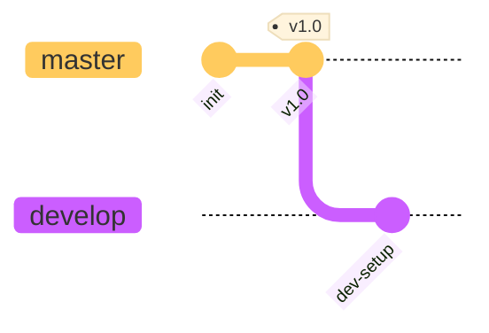

**Commands:**

```bash
# Initialize repository
git init git-workflow-demo
cd git-workflow-demo

# Create initial commit on master
echo "# Project" > README.md
git add README.md
git commit -m "init"

# Create v1.0 tag
echo "version: 1.0" > version.txt
git add version.txt
git commit -m "v1.0"
git tag v1.0

# Create develop branch
git switch -c develop
echo "# Development" > DEV.md
git add DEV.md
git commit -m "dev-setup"
```

---

## Feature Development Phase

### Step 2: Create Feature Branches

Four developers create feature branches from `develop`.

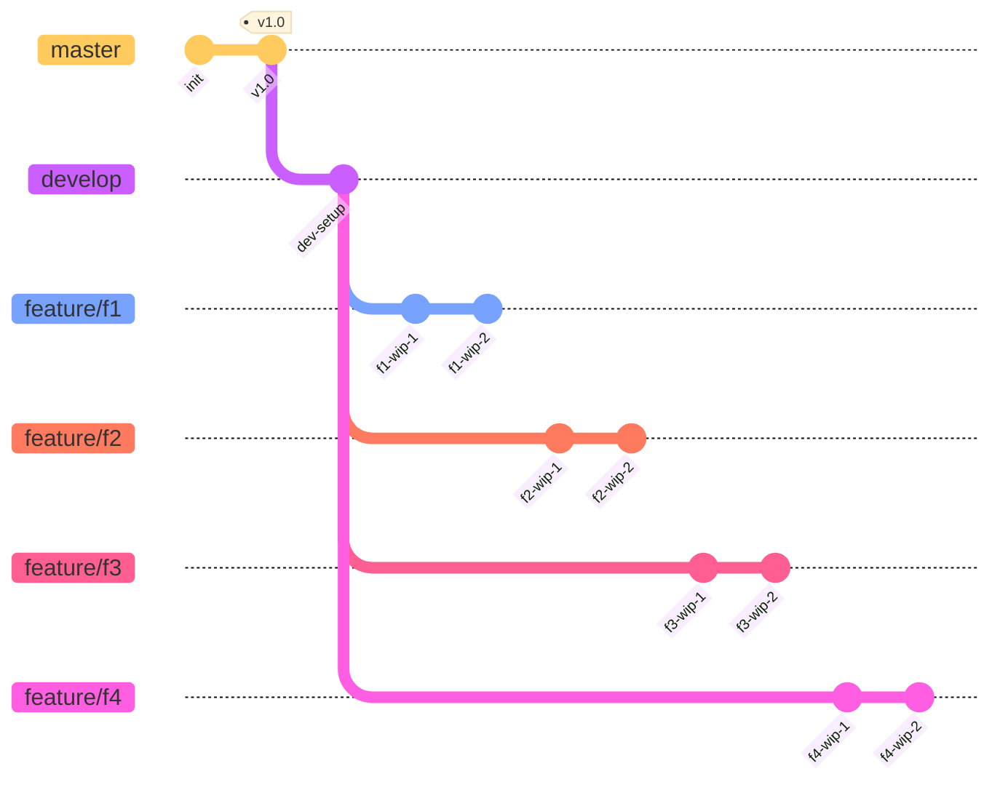

**Commands:**

```bash
# Create feature branches from develop
git switch develop
git switch -c feature/f1

# Developer 1 starts working on f1
echo "WIP: login endpoint" > login-wip.txt
git add login-wip.txt
git commit -m "WIP: Start login feature"

echo "WIP: add auth logic" >> login-wip.txt
git add login-wip.txt
git commit -m "WIP: Add authentication logic"

# Create remaining feature branches
git switch develop
git switch -c feature/f2

# Developer 2 starts working on f2
echo "WIP: dashboard layout" > dashboard-wip.txt
git add dashboard-wip.txt
git commit -m "WIP: Dashboard structure"

echo "WIP: add widgets" >> dashboard-wip.txt
git add dashboard-wip.txt
git commit -m "WIP: Add dashboard widgets"

git switch develop
git switch -c feature/f3

# Developer 3 starts working on f3
echo "WIP: reports base" > reports-wip.txt
git add reports-wip.txt
git commit -m "WIP: Reports module setup"

echo "WIP: add charts" >> reports-wip.txt
git add reports-wip.txt
git commit -m "WIP: Add report charts"

git switch develop
git switch -c feature/f4

# Developer 4 starts working on f4
echo "WIP: analytics tracking" > analytics-wip.txt
git add analytics-wip.txt
git commit -m "WIP: Analytics module base"

echo "WIP: add metrics" >> analytics-wip.txt
git add analytics-wip.txt
git commit -m "WIP: Add metrics collection"

# Verify all branches exist and have commits
git branch
# Output:
#   develop
#   feature/f1
#   feature/f2
#   feature/f3
# * feature/f4
#   master

# Check that f1 has work
git log --oneline feature/f1 -3
```

---

### Step 3: Develop and Merge Features f1, f2, f3

Developers complete features f1, f2, and f3. Each developer rebases on latest `develop`, squashes commits, and merges via fast-forward. Feature f4 (still in development) rebases onto the updated develop to get the latest changes.

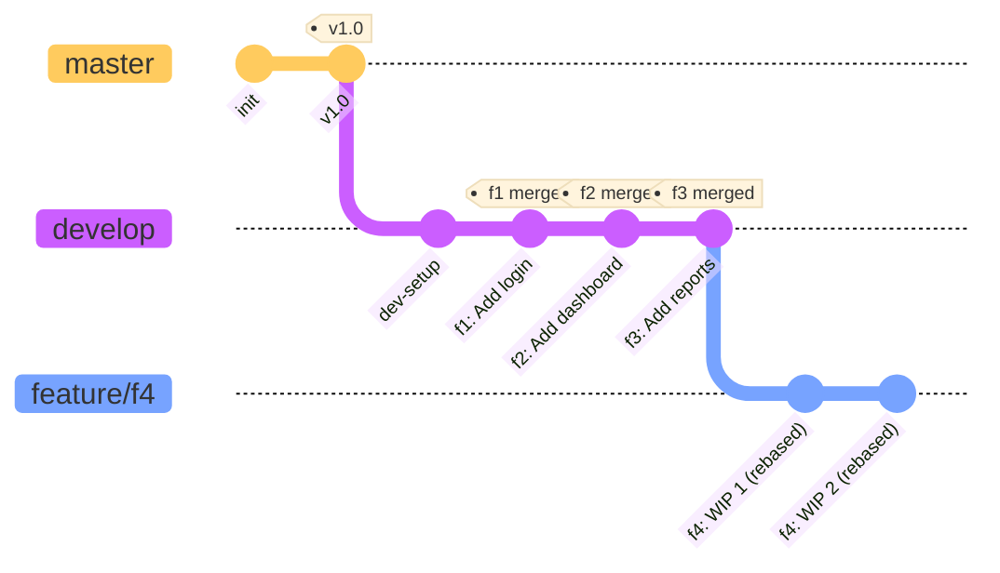

**Commands:**

```bash
# Developer 1: Complete feature f1
git switch feature/f1
echo "login feature" > login.txt
git add login.txt
git commit -m "Implement login endpoint"

echo "login tests" > login.test.txt
git add login.test.txt
git commit -m "Add login tests"

# Rebase and squash f1
git rebase develop
git rebase -i develop
# In editor: pick first commit, squash second
# Final message: "f1: Add login feature with tests"

# Merge f1 to develop
git switch develop
git merge --ff-only feature/f1
git branch -d feature/f1

# Developer 2: Complete feature f2
git switch feature/f2
git rebase develop  # Update with f1

echo "dashboard feature" > dashboard.txt
git add dashboard.txt
git commit -m "Implement dashboard"

echo "dashboard styles" > dashboard.css
git add dashboard.css
git commit -m "Add dashboard styling"

# Squash f2
git rebase -i develop
# Final message: "f2: Add dashboard with styling"

# Merge f2 to develop
git switch develop
git merge --ff-only feature/f2
git branch -d feature/f2

# Developer 3: Complete feature f3
git switch feature/f3
git rebase develop  # Update with f1 and f2

echo "reports feature" > reports.txt
git add reports.txt
git commit -m "Implement reports module"

echo "report templates" > templates.txt
git add templates.txt
git commit -m "Add report templates"

# Squash f3
git rebase -i develop
# Final message: "f3: Add reports module with templates"

# Merge f3 to develop
git switch develop
git merge --ff-only feature/f3
git branch -d feature/f3

# Verify develop has all three features
git log --oneline --graph -7

# Meanwhile, developer working on f4 rebases to get latest changes
git switch feature/f4
git rebase develop  # Now f4 has f1, f2, f3 changes

# Developer continues working on f4...
git log --oneline --graph -5
```

---

### Step 4: Feature f4 In Progress

Feature f4 is still being developed when release preparation begins.

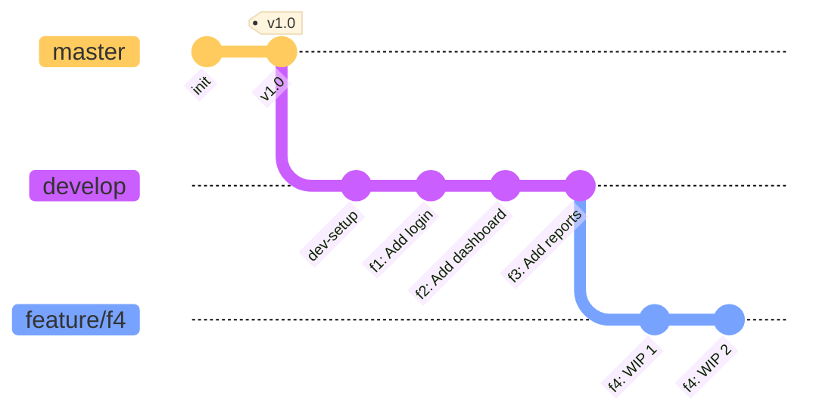

**Commands:**

```bash
# Developer working on f4
git switch feature/f4
git rebase develop  # Update with f1, f2, f3

echo "analytics feature - part 1" > analytics.txt
git add analytics.txt
git commit -m "Start analytics module"

echo "analytics feature - part 2" >> analytics.txt
git add analytics.txt
git commit -m "Continue analytics development"

# f4 is NOT ready yet - no merge to develop
# Developer continues working...

# Check current state
git log --oneline --graph -5
```

---

## First Release Candidate (RC1)

### Step 5: Create RC1 from Develop

Release manager creates RC1 containing f1, f2, and f3 for QA testing.

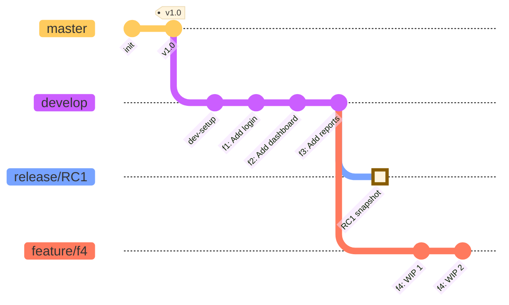

**Commands:**

```bash
# Release manager creates RC1
git switch develop
git switch -c release/RC1

# Push to remote for QA team
# git push origin release/RC1

# Verify RC1 state
git log --oneline --graph -7

# QA starts testing RC1...
# Meanwhile, development continues on develop!
```

---

### Step 6: Feature f4 Completes and Merges (Uninterrupted Development)

While QA tests RC1, developer finishes f4 and merges it to `develop`. This demonstrates **uninterrupted development** - the release process doesn't freeze the develop branch.

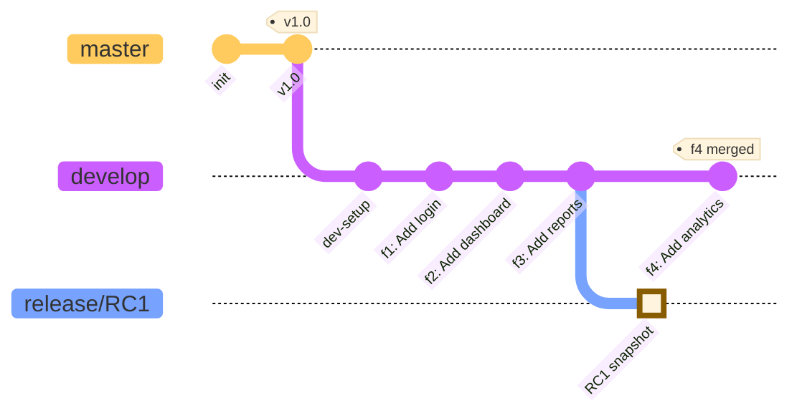

**Commands:**

```bash
# Developer completes f4
git switch feature/f4

echo "analytics feature - completed" >> analytics.txt
git add analytics.txt
git commit -m "Complete analytics module"

# Rebase on develop and squash
git rebase develop
git rebase -i develop
# Final message: "f4: Add analytics module"

# Merge to develop (development continues!)
git switch develop
git merge --ff-only feature/f4

# Clean up feature branch
git branch -d feature/f4

# Current state: develop has f1, f2, f3, f4
# RC1 still only has f1, f2, f3
git log --oneline --graph -8
```

---

## Feature Rejection and Recovery

### Step 7: QA Rejects f2, Delete RC1

QA finds issues with f2 - it cannot be released in this version. RC1 is deleted.

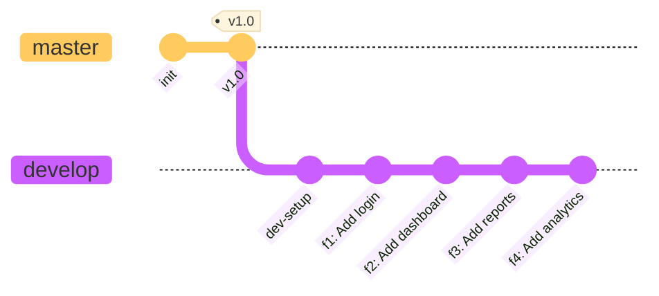

**Commands:**

```bash
# QA reports f2 has critical issues, cannot be released
# Release manager deletes RC1
git branch -D release/RC1

# Also delete from remote if pushed
# git push origin --delete release/RC1

# Decision: Release v1.1 with only f1 and f3
# f2 and f4 will be in next release (v1.2)

# Verify current state
git branch
git log --oneline --graph develop -8
```

---

### Step 8: Reorganize Develop (Interactive Rebase)

Release manager reorganizes `develop` history to move f2 and f4 after the release point. This allows creating RC2 from a commit that contains only f1 and f3.

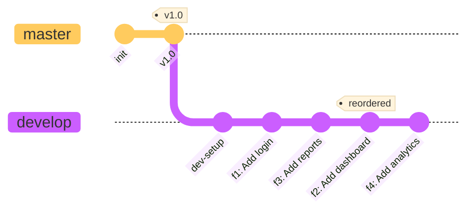

**Commands:**

```bash
# Release manager reorganizes develop
git switch develop

# First, check current commit order
git log --oneline v1.0..develop

# Output shows (newest first):
# <hash-f4> f4: Add analytics module
# <hash-f3> f3: Add reports module with templates
# <hash-f2> f2: Add dashboard with styling
# <hash-f1> f1: Add login feature with tests
# <hash-dev> dev-setup

# Interactive rebase to reorder commits
# We want final order: dev-setup -> f1 -> f3 -> f2 -> f4
git rebase -i v1.0

# Your editor will open with commits listed (oldest to newest):
# pick <hash-dev> dev-setup
# pick <hash-f1> f1: Add login feature with tests
# pick <hash-f2> f2: Add dashboard with styling
# pick <hash-f3> f3: Add reports module with templates
# pick <hash-f4> f4: Add analytics module

# Reorder by moving the f3 line before f2:
# pick <hash-dev> dev-setup
# pick <hash-f1> f1: Add login feature with tests
# pick <hash-f3> f3: Add reports module with templates
# pick <hash-f2> f2: Add dashboard with styling
# pick <hash-f4> f4: Add analytics module

# Save and exit (VS Code will close automatically if you have it configured as git editor)
# Git will replay commits in the new order

# Verify new order
git log --oneline --graph v1.0..develop

# Output should show (newest first):
# * <hash> f4: Add analytics module
# * <hash> f2: Add dashboard with styling
# * <hash> f3: Add reports module with templates
# * <hash> f1: Add login feature with tests
# * <hash> dev-setup
```

**Note:** Since develop is a shared branch, this reorganization should be coordinated with the team. In practice, you might:

- Notify all developers before reorganizing
- Have them stop pushing to develop temporarily
- Or use a temporary branch for reorganization and then replace develop

---

### Step 9: Create RC2 from Appropriate Commit

Create RC2 from the commit containing only approved features (f1 and f3).

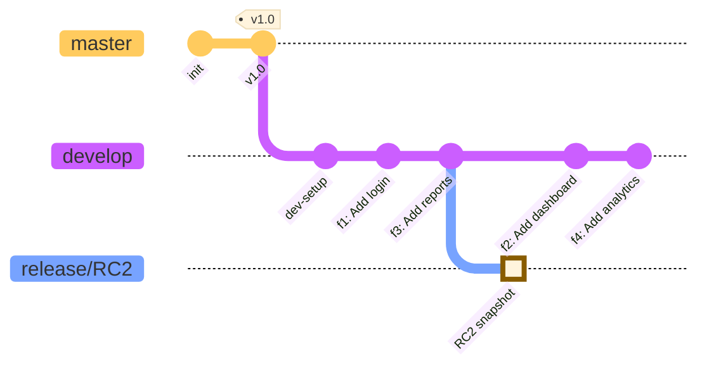

**Commands:**

```bash
# Find the commit hash for f3 (last approved feature)
git log --oneline --graph v1.0..develop

# Output shows (newest first):
# <hash-f4> f4: Add analytics module
# <hash-f2> f2: Add dashboard with styling
# <hash-f3> f3: Add reports module with templates  <- We want this
# <hash-f1> f1: Add login feature with tests
# <hash-dev> dev-setup

# Create RC2 from the f3 commit (copy the actual hash from output above)
git switch -c release/RC2 <hash-f3>

# For example, if hash is 11a7600:
# git switch -c release/RC2 11a7600

# Or using relative reference (2 commits before develop HEAD):
# git switch -c release/RC2 develop~2

# Verify RC2 contains only f1 and f3 (not f2 and f4)
git log --oneline --graph --all

# You should see RC2 pointing to f3, with develop ahead at f4
# * <hash-f4> (develop) f4: Add analytics module
# * <hash-f2> f2: Add dashboard with styling
# * <hash-f3> (HEAD -> release/RC2) f3: Add reports module with templates
# * <hash-f1> f1: Add login feature with tests
# * <hash-dev> dev-setup
# * <hash-v1.0> (tag: v1.0, master) v1.0

# Push for QA testing
# git push origin release/RC2
```

---

## Successful Release

### Step 10: RC2 Passes QA - Merge to Master

RC2 passes QA testing and is merged to master with a version tag.

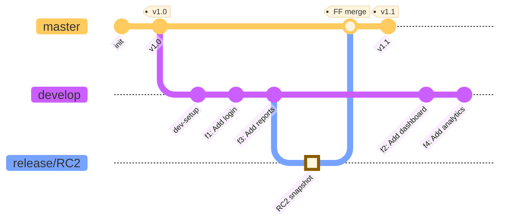

**Commands:**

```bash
# QA approves RC2
# Release manager merges to master

git switch master
git merge --ff-only release/RC2

# Verify merge was fast-forward
# Output: "Fast-forward"

# Tag the release
git tag -a v1.1 -m "Release v1.1: Login and Reports features"

# Push to remote
# git push origin master
# git push origin v1.1

# Clean up RC2 branch
git branch -d release/RC2
# git push origin --delete release/RC2

# Verify master state
git log --oneline --graph master -6
```

---

### Step 11: Rebase Develop on Master

After the release, rebase `develop` on the new `master` to sync the histories.

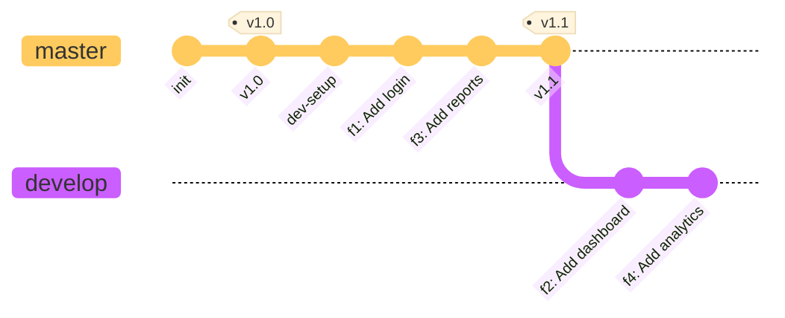

**Commands:**

```bash
# Rebase develop on the new master
git switch develop
git rebase master

# Develop now continues from v1.1
# f2 and f4 are ready for the next release

# Force push develop (coordinate with team!)
# git push --force-with-lease origin develop

# Verify the rebased history
git log --oneline --graph --all -10

# Output shows:
# * <hash> f4: Add analytics module (develop)
# * <hash> f2: Add dashboard with styling
# * <hash> v1.1 (tag: v1.1, master)
# * <hash> f3: Add reports module with templates
# * <hash> f1: Add login feature with tests
# * <hash> dev-setup
# * <hash> v1.0 (tag: v1.0)
```

---

## Handling In-Progress Features

### Step 12: Feature f5 Rebases with --onto

A developer was working on feature f5 during this entire process. They created f5 BEFORE develop was reorganized, so f5 was based on the old commit where f2 was still before f3.

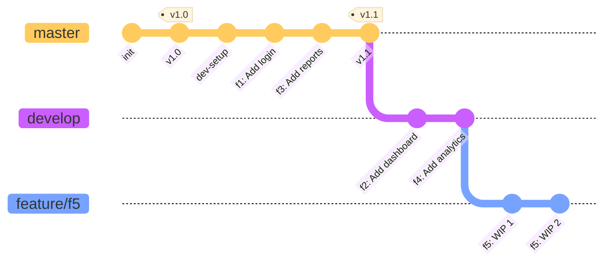

**Scenario:**

- Developer created f5 from old develop history (when order was: dev-setup → f1 → f2 → f3 → f4)
- Specifically, f5 branched from the f2 commit
- Now develop has been reorganized: v1.1 (f1, f3) → f2 → f4
- f5 needs to rebase onto the NEW develop HEAD to get f2 and f4 changes

**Commands:**

```bash
# Simulate: Developer had created f5 from old position (before reorganization)
# We'll create it from the f2 commit to demonstrate the scenario

# First, find the f2 commit hash from the reorganized develop
git log --oneline v1.0..develop

# Output shows:
# <hash-f4> f4: Add analytics module        (develop HEAD)
# <hash-f2> f2: Add dashboard with styling  <- f5 was based here
# <hash-f3> f3: Add reports module with templates
# <hash-f1> f1: Add login feature with tests
# <hash-dev> dev-setup

# Create f5 from the f2 commit (simulating old branch point)
git switch -c feature/f5 <hash-f2>

# For example: git switch -c feature/f5 be52690

# Developer adds their f5 work
echo "notifications feature" > notifications.txt
git add notifications.txt
git commit -m "f5: Add notifications system"

# Check the state - f5 is based on f2, missing f4
git log --oneline --graph --all

# Now rebase f5 onto current develop using --onto
# This moves f5 commits from old base (f2) to new base (develop HEAD)
git rebase --onto develop <hash-f2> feature/f5

# For example: git rebase --onto develop be52690 feature/f5

# Explanation of --onto command:
# --onto develop        : Move commits onto develop (new base)
# <hash-f2>            : Old base (where f5 originally branched from)
# feature/f5           : Branch to rebase

# After rebase, f5 is now based on develop HEAD (which includes f2 and f4)
git log --oneline --graph --all

# Output should show:
# * <new-hash> (HEAD -> feature/f5) f5: Add notifications system
# * <hash-f4> (develop) f4: Add analytics module
# * <hash-f2> f2: Add dashboard with styling
# * <hash-f3> f3: Add reports module with templates
# ...

# Force push the rebased feature branch
# git push --force-with-lease origin feature/f5
```

**Key Points about --onto:**

- `git rebase --onto <newbase> <oldbase> <branch>` moves commits from `<oldbase>` to `<newbase>`
- In our case: move f5's commits from f2 to develop HEAD
- This is necessary when the base commit of your branch has moved or been reorganized
- Without `--onto`, a simple `git rebase develop` might include unwanted commits or fail

---

## Summary

### Final Repository State


### Key Takeaways

1. **Uninterrupted Development**: f4 was completed and merged to develop while QA was testing RC1
2. **Feature Rejection Handling**: f2 was rejected and excluded from release through develop reorganization
3. **Clean Linear History**: All merges were fast-forward only, maintaining clean history
4. **Selective Release**: Only approved features (f1, f3) were released in v1.1
5. **Post-Release Sync**: develop was rebased on master after release
6. **In-Progress Features**: f5 successfully rebased onto reorganized develop

### What's Next

- **v1.2 Release** will include f2 (after fixes) and f4
- **Feature f5** continues development
- **develop** branch remains the integration point for all new work
- **master** branch remains stable with only production-ready releases

---

## Testing This Workflow

To test this entire workflow in a real repository:

```bash
# Create a temporary directory
mkdir /tmp/git-workflow-test
cd /tmp/git-workflow-test

# Then execute each step's commands in sequence
# This will create a complete example repository
# demonstrating the entire workflow
```

